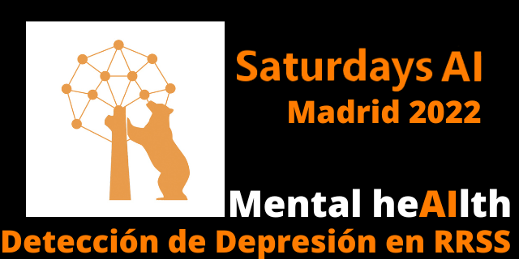

### Utilización de técnicas de Inteligencia Artificial para captar patrones de depresión en redes sociales.

[**Saturdays AI**](https://saturdays.ai/) es un movimiento comunitario y global dedicado al desarrollo de la educación en Inteligencia Artificial a través de contenido de calidad. El objetivo es que esta tecnología sea accesible para todos a través del desarrollo de proyectos con impacto social.

Este repositorio engloba el proyecto realizado durante la edición de ** Saturdays AI 2022 en Madrid **. El proyecto se basa en trabajos previos sobre el tema ya que es un tema de gran interés.

### El equipo está formado por 4 personas:
- Daniel Rodríguez
- Mar Pino
- Raquel Martín
- Victor Barahona

### Planificación

Durante seis semanas el equipo ha trabajado en el proyecto siguiendo el siguiente plan de acción.

*En construcción*

 ### Características principales:

El proyecto parte de un conjunto de datos con muchos tweets de varias personas que han sido etiquetadas con o sin estado depresivo. Este marcado se ha hecho por personas especialistas por lo que el ** dataframe ** es fiable.

El proyecto debe limpiar previamente este fichero para poder procesar, es bastante extenso y por ello requiere bastante cálculo.

### Desarrollo futuro

- .

